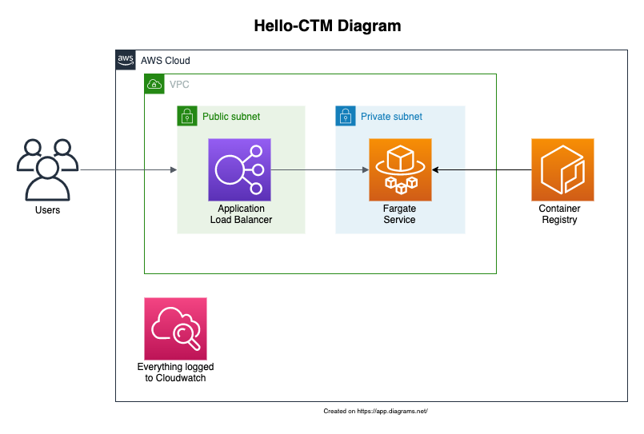

# hello-ctm

## The task
Create a clustered web service in AWS that responds to a GET request with "hello world" and the date and time.

---
## Diagram


---
## My solution
I went with AWS Fargate, I thought it suited a single service better than standing up a whole k8s cluster and dealing with the overhead.

---
## Pipeline
In order to be able to test this locally and keep things platform-agnostic, I went with a Makefile.  
I haven't really worked much with Makefiles before so this was a good learning experience, picked it up from some colleagues at work. 
ECR has to be deployed before code due to a chicken/egg scenario since it has to exist before the docker image can be pushed.  
I don't have a Jenkins instance to test on, so not sure it will work, but it should be close enough (may have to tweak the TF apply steps to allow user confirmation). I also haven't built the CI agent that will run the pipeline (figured it was out of scope)

---
## Usage

In addition to be being authenticated to AWS, the following ENVVARS must be set:
- AWS_DEFAULT_REGION
- AWS_ACCOUNT_NUMBER

The following applications must be installed:
- aws cli
- docker (daemon must be running)
- terraform

Clone the repo:
```shell
git clone https://github.com/philnichol/hello-ctm.git
cd hello-ctm
```

To build and run the flask container locally:
```shell
make runlocal
curl 127.0.0.1:5000/
```

To deploy all infra (with prompt for confirmation):
```shell
make all
```

To destroy the infra (with prompt for confirmation):
```shell
make destroy
```

---
## Documentation
Further documentation can be found within each subfolder of this repo:
- [Infrastructure](infrastructure/)
- [Fargate Module](infrastructure/fargate_service/)
- [VPC Module](infrastructure/vpc/)
- [Code](code/)
